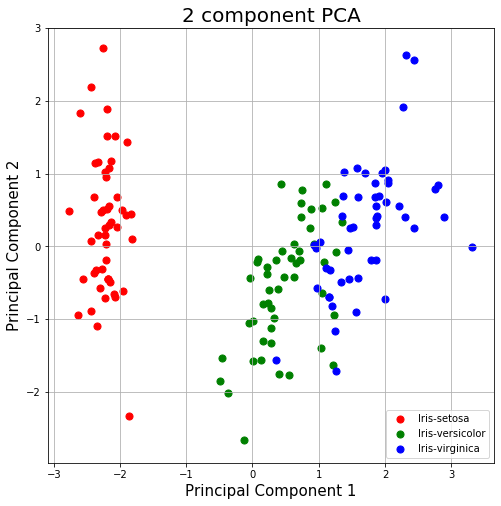
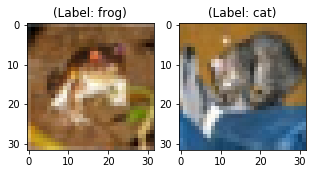
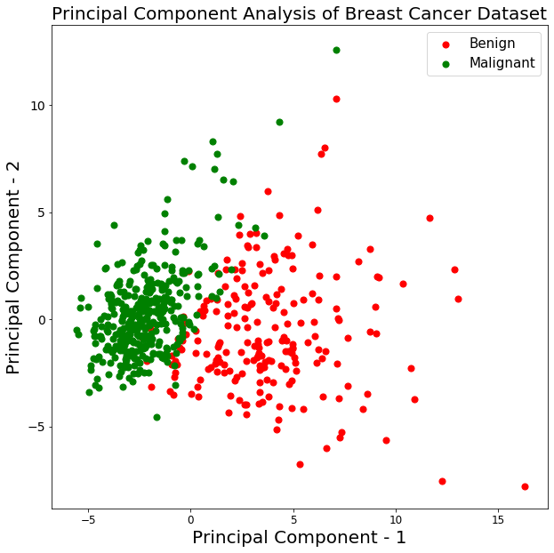
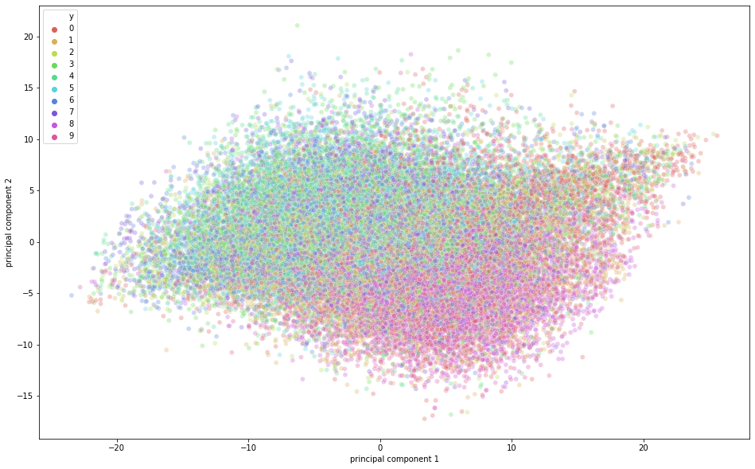

# Principal Component Analysis (PCA) in Python


```python
import pandas as pd
import numpy as np
```


```python
url = "https://archive.ics.uci.edu/ml/machine-learning-databases/iris/iris.data"
```


```python
# load dataset into Pandas DataFrame
df = pd.read_csv(url, names=['sepal length','sepal width','petal length','petal width','target'])
```


```python
print(df.shape)
print(df[:10])
print(np.unique(df['target']))
```

    (150, 5)
       sepal length  sepal width  petal length  petal width       target
    0           5.1          3.5           1.4          0.2  Iris-setosa
    1           4.9          3.0           1.4          0.2  Iris-setosa
    2           4.7          3.2           1.3          0.2  Iris-setosa
    3           4.6          3.1           1.5          0.2  Iris-setosa
    4           5.0          3.6           1.4          0.2  Iris-setosa
    5           5.4          3.9           1.7          0.4  Iris-setosa
    6           4.6          3.4           1.4          0.3  Iris-setosa
    7           5.0          3.4           1.5          0.2  Iris-setosa
    8           4.4          2.9           1.4          0.2  Iris-setosa
    9           4.9          3.1           1.5          0.1  Iris-setosa
    ['Iris-setosa' 'Iris-versicolor' 'Iris-virginica']
    


```python
from sklearn.preprocessing import StandardScaler
from sklearn.decomposition import PCA
```


```python
features = ['sepal length', 'sepal width', 'petal length', 'petal width']
# Separating out the features
x = df.loc[:, features].values
# Separating out the target
y = df.loc[:,['target']].values
# Standardizing the features,Standardize features by removing the mean and scaling to unit variance
x = StandardScaler().fit_transform(x)
```


```python
print(x.shape)
print(y.shape)
print(x[:10])
print(y[:10])
```

    (150, 4)
    (150, 1)
    [[-0.90068117  1.03205722 -1.3412724  -1.31297673]
     [-1.14301691 -0.1249576  -1.3412724  -1.31297673]
     [-1.38535265  0.33784833 -1.39813811 -1.31297673]
     [-1.50652052  0.10644536 -1.2844067  -1.31297673]
     [-1.02184904  1.26346019 -1.3412724  -1.31297673]
     [-0.53717756  1.95766909 -1.17067529 -1.05003079]
     [-1.50652052  0.80065426 -1.3412724  -1.18150376]
     [-1.02184904  0.80065426 -1.2844067  -1.31297673]
     [-1.74885626 -0.35636057 -1.3412724  -1.31297673]
     [-1.14301691  0.10644536 -1.2844067  -1.4444497 ]]
    [['Iris-setosa']
     ['Iris-setosa']
     ['Iris-setosa']
     ['Iris-setosa']
     ['Iris-setosa']
     ['Iris-setosa']
     ['Iris-setosa']
     ['Iris-setosa']
     ['Iris-setosa']
     ['Iris-setosa']]
    


```python
print(x.mean(axis=0))
print(x.std(axis=0))
```

    [-4.73695157e-16 -6.63173220e-16  3.31586610e-16 -2.84217094e-16]
    [1. 1. 1. 1.]
    


```python
pca = PCA(n_components=2)
principalComponents = pca.fit_transform(x)
principalDf = pd.DataFrame(data = principalComponents
             , columns = ['principal component 1', 'principal component 2'])
```


```python
print(principalDf.shape)
print(principalDf[:10])
```

    (150, 2)
       principal component 1  principal component 2
    0              -2.264542               0.505704
    1              -2.086426              -0.655405
    2              -2.367950              -0.318477
    3              -2.304197              -0.575368
    4              -2.388777               0.674767
    5              -2.070537               1.518549
    6              -2.445711               0.074563
    7              -2.233842               0.247614
    8              -2.341958              -1.095146
    9              -2.188676              -0.448629
    


```python
finalDf = pd.concat([principalDf, df[['target']]], axis = 1)
```


```python
print(finalDf.shape)
print(finalDf[:10])
```

    (150, 3)
       principal component 1  principal component 2       target
    0              -2.264542               0.505704  Iris-setosa
    1              -2.086426              -0.655405  Iris-setosa
    2              -2.367950              -0.318477  Iris-setosa
    3              -2.304197              -0.575368  Iris-setosa
    4              -2.388777               0.674767  Iris-setosa
    5              -2.070537               1.518549  Iris-setosa
    6              -2.445711               0.074563  Iris-setosa
    7              -2.233842               0.247614  Iris-setosa
    8              -2.341958              -1.095146  Iris-setosa
    9              -2.188676              -0.448629  Iris-setosa
    


```python
import matplotlib.pyplot as plt

fig = plt.figure(figsize = (8,8))
ax = fig.add_subplot(1,1,1) 
ax.set_xlabel('Principal Component 1', fontsize = 15)
ax.set_ylabel('Principal Component 2', fontsize = 15)
ax.set_title('2 component PCA', fontsize = 20)
targets = ['Iris-setosa', 'Iris-versicolor', 'Iris-virginica']
colors = ['r', 'g', 'b']
for target, color in zip(targets,colors):
    indicesToKeep = finalDf['target'] == target
    ax.scatter(finalDf.loc[indicesToKeep, 'principal component 1']
               , finalDf.loc[indicesToKeep, 'principal component 2']
               , c = color
               , s = 50)
ax.legend(targets)
ax.grid()
```





```python
from sklearn.datasets import load_breast_cancer
```


```python
breast = load_breast_cancer()
breast_data = breast.data
```


```python
breast_data.shape
```


    (569, 30)


```python
breast_data[:4]
```


    array([[1.799e+01, 1.038e+01, 1.228e+02, 1.001e+03, 1.184e-01, 2.776e-01,
            3.001e-01, 1.471e-01, 2.419e-01, 7.871e-02, 1.095e+00, 9.053e-01,
            8.589e+00, 1.534e+02, 6.399e-03, 4.904e-02, 5.373e-02, 1.587e-02,
            3.003e-02, 6.193e-03, 2.538e+01, 1.733e+01, 1.846e+02, 2.019e+03,
            1.622e-01, 6.656e-01, 7.119e-01, 2.654e-01, 4.601e-01, 1.189e-01],
           [2.057e+01, 1.777e+01, 1.329e+02, 1.326e+03, 8.474e-02, 7.864e-02,
            8.690e-02, 7.017e-02, 1.812e-01, 5.667e-02, 5.435e-01, 7.339e-01,
            3.398e+00, 7.408e+01, 5.225e-03, 1.308e-02, 1.860e-02, 1.340e-02,
            1.389e-02, 3.532e-03, 2.499e+01, 2.341e+01, 1.588e+02, 1.956e+03,
            1.238e-01, 1.866e-01, 2.416e-01, 1.860e-01, 2.750e-01, 8.902e-02],
           [1.969e+01, 2.125e+01, 1.300e+02, 1.203e+03, 1.096e-01, 1.599e-01,
            1.974e-01, 1.279e-01, 2.069e-01, 5.999e-02, 7.456e-01, 7.869e-01,
            4.585e+00, 9.403e+01, 6.150e-03, 4.006e-02, 3.832e-02, 2.058e-02,
            2.250e-02, 4.571e-03, 2.357e+01, 2.553e+01, 1.525e+02, 1.709e+03,
            1.444e-01, 4.245e-01, 4.504e-01, 2.430e-01, 3.613e-01, 8.758e-02],
           [1.142e+01, 2.038e+01, 7.758e+01, 3.861e+02, 1.425e-01, 2.839e-01,
            2.414e-01, 1.052e-01, 2.597e-01, 9.744e-02, 4.956e-01, 1.156e+00,
            3.445e+00, 2.723e+01, 9.110e-03, 7.458e-02, 5.661e-02, 1.867e-02,
            5.963e-02, 9.208e-03, 1.491e+01, 2.650e+01, 9.887e+01, 5.677e+02,
            2.098e-01, 8.663e-01, 6.869e-01, 2.575e-01, 6.638e-01, 1.730e-01]])


```python
breast_labels = breast.target
breast_labels.shape
```


    (569,)


```python
labels = np.reshape(breast_labels,(569,1))
```


```python
final_breast_data = np.concatenate([breast_data,labels],axis=1)
final_breast_data.shape
```


    (569, 31)


```python
breast_dataset = pd.DataFrame(final_breast_data)
```


```python
features = breast.feature_names
features
```


    array(['mean radius', 'mean texture', 'mean perimeter', 'mean area',
           'mean smoothness', 'mean compactness', 'mean concavity',
           'mean concave points', 'mean symmetry', 'mean fractal dimension',
           'radius error', 'texture error', 'perimeter error', 'area error',
           'smoothness error', 'compactness error', 'concavity error',
           'concave points error', 'symmetry error',
           'fractal dimension error', 'worst radius', 'worst texture',
           'worst perimeter', 'worst area', 'worst smoothness',
           'worst compactness', 'worst concavity', 'worst concave points',
           'worst symmetry', 'worst fractal dimension'], dtype='<U23')


```python
features_labels = np.append(features,'label')
breast_dataset.columns = features_labels
```


```python
breast_dataset.head()
```


<div>
<style scoped>
    .dataframe tbody tr th:only-of-type {
        vertical-align: middle;
    }

    .dataframe tbody tr th {
        vertical-align: top;
    }

    .dataframe thead th {
        text-align: right;
    }
</style>
<table border="1" class="dataframe">
  <thead>
    <tr style="text-align: right;">
      <th></th>
      <th>mean radius</th>
      <th>mean texture</th>
      <th>mean perimeter</th>
      <th>mean area</th>
      <th>mean smoothness</th>
      <th>mean compactness</th>
      <th>mean concavity</th>
      <th>mean concave points</th>
      <th>mean symmetry</th>
      <th>mean fractal dimension</th>
      <th>...</th>
      <th>worst texture</th>
      <th>worst perimeter</th>
      <th>worst area</th>
      <th>worst smoothness</th>
      <th>worst compactness</th>
      <th>worst concavity</th>
      <th>worst concave points</th>
      <th>worst symmetry</th>
      <th>worst fractal dimension</th>
      <th>label</th>
    </tr>
  </thead>
  <tbody>
    <tr>
      <th>0</th>
      <td>17.99</td>
      <td>10.38</td>
      <td>122.80</td>
      <td>1001.0</td>
      <td>0.11840</td>
      <td>0.27760</td>
      <td>0.3001</td>
      <td>0.14710</td>
      <td>0.2419</td>
      <td>0.07871</td>
      <td>...</td>
      <td>17.33</td>
      <td>184.60</td>
      <td>2019.0</td>
      <td>0.1622</td>
      <td>0.6656</td>
      <td>0.7119</td>
      <td>0.2654</td>
      <td>0.4601</td>
      <td>0.11890</td>
      <td>0.0</td>
    </tr>
    <tr>
      <th>1</th>
      <td>20.57</td>
      <td>17.77</td>
      <td>132.90</td>
      <td>1326.0</td>
      <td>0.08474</td>
      <td>0.07864</td>
      <td>0.0869</td>
      <td>0.07017</td>
      <td>0.1812</td>
      <td>0.05667</td>
      <td>...</td>
      <td>23.41</td>
      <td>158.80</td>
      <td>1956.0</td>
      <td>0.1238</td>
      <td>0.1866</td>
      <td>0.2416</td>
      <td>0.1860</td>
      <td>0.2750</td>
      <td>0.08902</td>
      <td>0.0</td>
    </tr>
    <tr>
      <th>2</th>
      <td>19.69</td>
      <td>21.25</td>
      <td>130.00</td>
      <td>1203.0</td>
      <td>0.10960</td>
      <td>0.15990</td>
      <td>0.1974</td>
      <td>0.12790</td>
      <td>0.2069</td>
      <td>0.05999</td>
      <td>...</td>
      <td>25.53</td>
      <td>152.50</td>
      <td>1709.0</td>
      <td>0.1444</td>
      <td>0.4245</td>
      <td>0.4504</td>
      <td>0.2430</td>
      <td>0.3613</td>
      <td>0.08758</td>
      <td>0.0</td>
    </tr>
    <tr>
      <th>3</th>
      <td>11.42</td>
      <td>20.38</td>
      <td>77.58</td>
      <td>386.1</td>
      <td>0.14250</td>
      <td>0.28390</td>
      <td>0.2414</td>
      <td>0.10520</td>
      <td>0.2597</td>
      <td>0.09744</td>
      <td>...</td>
      <td>26.50</td>
      <td>98.87</td>
      <td>567.7</td>
      <td>0.2098</td>
      <td>0.8663</td>
      <td>0.6869</td>
      <td>0.2575</td>
      <td>0.6638</td>
      <td>0.17300</td>
      <td>0.0</td>
    </tr>
    <tr>
      <th>4</th>
      <td>20.29</td>
      <td>14.34</td>
      <td>135.10</td>
      <td>1297.0</td>
      <td>0.10030</td>
      <td>0.13280</td>
      <td>0.1980</td>
      <td>0.10430</td>
      <td>0.1809</td>
      <td>0.05883</td>
      <td>...</td>
      <td>16.67</td>
      <td>152.20</td>
      <td>1575.0</td>
      <td>0.1374</td>
      <td>0.2050</td>
      <td>0.4000</td>
      <td>0.1625</td>
      <td>0.2364</td>
      <td>0.07678</td>
      <td>0.0</td>
    </tr>
  </tbody>
</table>
<p>5 rows × 31 columns</p>
</div>


```python
breast_dataset['label'].replace(0, 'Benign',inplace=True)
breast_dataset['label'].replace(1, 'Malignant',inplace=True)
```


```python
breast_dataset.tail()
```


<div>
<style scoped>
    .dataframe tbody tr th:only-of-type {
        vertical-align: middle;
    }

    .dataframe tbody tr th {
        vertical-align: top;
    }

    .dataframe thead th {
        text-align: right;
    }
</style>
<table border="1" class="dataframe">
  <thead>
    <tr style="text-align: right;">
      <th></th>
      <th>mean radius</th>
      <th>mean texture</th>
      <th>mean perimeter</th>
      <th>mean area</th>
      <th>mean smoothness</th>
      <th>mean compactness</th>
      <th>mean concavity</th>
      <th>mean concave points</th>
      <th>mean symmetry</th>
      <th>mean fractal dimension</th>
      <th>...</th>
      <th>worst texture</th>
      <th>worst perimeter</th>
      <th>worst area</th>
      <th>worst smoothness</th>
      <th>worst compactness</th>
      <th>worst concavity</th>
      <th>worst concave points</th>
      <th>worst symmetry</th>
      <th>worst fractal dimension</th>
      <th>label</th>
    </tr>
  </thead>
  <tbody>
    <tr>
      <th>564</th>
      <td>21.56</td>
      <td>22.39</td>
      <td>142.00</td>
      <td>1479.0</td>
      <td>0.11100</td>
      <td>0.11590</td>
      <td>0.24390</td>
      <td>0.13890</td>
      <td>0.1726</td>
      <td>0.05623</td>
      <td>...</td>
      <td>26.40</td>
      <td>166.10</td>
      <td>2027.0</td>
      <td>0.14100</td>
      <td>0.21130</td>
      <td>0.4107</td>
      <td>0.2216</td>
      <td>0.2060</td>
      <td>0.07115</td>
      <td>Benign</td>
    </tr>
    <tr>
      <th>565</th>
      <td>20.13</td>
      <td>28.25</td>
      <td>131.20</td>
      <td>1261.0</td>
      <td>0.09780</td>
      <td>0.10340</td>
      <td>0.14400</td>
      <td>0.09791</td>
      <td>0.1752</td>
      <td>0.05533</td>
      <td>...</td>
      <td>38.25</td>
      <td>155.00</td>
      <td>1731.0</td>
      <td>0.11660</td>
      <td>0.19220</td>
      <td>0.3215</td>
      <td>0.1628</td>
      <td>0.2572</td>
      <td>0.06637</td>
      <td>Benign</td>
    </tr>
    <tr>
      <th>566</th>
      <td>16.60</td>
      <td>28.08</td>
      <td>108.30</td>
      <td>858.1</td>
      <td>0.08455</td>
      <td>0.10230</td>
      <td>0.09251</td>
      <td>0.05302</td>
      <td>0.1590</td>
      <td>0.05648</td>
      <td>...</td>
      <td>34.12</td>
      <td>126.70</td>
      <td>1124.0</td>
      <td>0.11390</td>
      <td>0.30940</td>
      <td>0.3403</td>
      <td>0.1418</td>
      <td>0.2218</td>
      <td>0.07820</td>
      <td>Benign</td>
    </tr>
    <tr>
      <th>567</th>
      <td>20.60</td>
      <td>29.33</td>
      <td>140.10</td>
      <td>1265.0</td>
      <td>0.11780</td>
      <td>0.27700</td>
      <td>0.35140</td>
      <td>0.15200</td>
      <td>0.2397</td>
      <td>0.07016</td>
      <td>...</td>
      <td>39.42</td>
      <td>184.60</td>
      <td>1821.0</td>
      <td>0.16500</td>
      <td>0.86810</td>
      <td>0.9387</td>
      <td>0.2650</td>
      <td>0.4087</td>
      <td>0.12400</td>
      <td>Benign</td>
    </tr>
    <tr>
      <th>568</th>
      <td>7.76</td>
      <td>24.54</td>
      <td>47.92</td>
      <td>181.0</td>
      <td>0.05263</td>
      <td>0.04362</td>
      <td>0.00000</td>
      <td>0.00000</td>
      <td>0.1587</td>
      <td>0.05884</td>
      <td>...</td>
      <td>30.37</td>
      <td>59.16</td>
      <td>268.6</td>
      <td>0.08996</td>
      <td>0.06444</td>
      <td>0.0000</td>
      <td>0.0000</td>
      <td>0.2871</td>
      <td>0.07039</td>
      <td>Malignant</td>
    </tr>
  </tbody>
</table>
<p>5 rows × 31 columns</p>
</div>


```python
from keras.datasets import cifar10
```


```python
(x_train, y_train), (x_test, y_test) = cifar10.load_data()
```


```python

```


```python
print('Traning data shape:', x_train.shape)
print('Testing data shape:', x_test.shape)
```

    Traning data shape: (50000, 32, 32, 3)
    Testing data shape: (10000, 32, 32, 3)
    


```python
y_train.shape,y_test.shape
```


    ((50000, 1), (10000, 1))


```python
# Find the unique numbers from the train labels
classes = np.unique(y_train)
nClasses = len(classes)
print('Total number of outputs : ', nClasses)
print('Output classes : ', classes)
```

    Total number of outputs :  10
    Output classes :  [0 1 2 3 4 5 6 7 8 9]
    


```python
import matplotlib.pyplot as plt
%matplotlib inline
```


```python
    label_dict = {
 0: 'airplane',
 1: 'automobile',
 2: 'bird',
 3: 'cat',
 4: 'deer',
 5: 'dog',
 6: 'frog',
 7: 'horse',
 8: 'ship',
 9: 'truck',
}
```


```python
plt.figure(figsize=[5,5])

# Display the first image in training data
plt.subplot(121)
curr_img = np.reshape(x_train[0], (32,32,3))
plt.imshow(curr_img)
print(plt.title("(Label: " + str(label_dict[y_train[0][0]]) + ")"))

# Display the first image in testing data
plt.subplot(122)
curr_img = np.reshape(x_test[0],(32,32,3))
plt.imshow(curr_img)
print(plt.title("(Label: " + str(label_dict[y_test[0][0]]) + ")"))
```

    Text(0.5, 1.0, '(Label: frog)')
    Text(0.5, 1.0, '(Label: cat)')
    





```python
from sklearn.preprocessing import StandardScaler
x = breast_dataset.loc[:, features].values
x = StandardScaler().fit_transform(x) # normalizing the features
```


```python
x.shape
```


    (569, 30)


```python
np.mean(x),np.std(x)
```


    (-6.826538293184326e-17, 1.0)


```python
feat_cols = ['feature'+str(i) for i in range(x.shape[1])]
normalised_breast = pd.DataFrame(x,columns=feat_cols)
normalised_breast.tail()
```


<div>
<style scoped>
    .dataframe tbody tr th:only-of-type {
        vertical-align: middle;
    }

    .dataframe tbody tr th {
        vertical-align: top;
    }

    .dataframe thead th {
        text-align: right;
    }
</style>
<table border="1" class="dataframe">
  <thead>
    <tr style="text-align: right;">
      <th></th>
      <th>feature0</th>
      <th>feature1</th>
      <th>feature2</th>
      <th>feature3</th>
      <th>feature4</th>
      <th>feature5</th>
      <th>feature6</th>
      <th>feature7</th>
      <th>feature8</th>
      <th>feature9</th>
      <th>...</th>
      <th>feature20</th>
      <th>feature21</th>
      <th>feature22</th>
      <th>feature23</th>
      <th>feature24</th>
      <th>feature25</th>
      <th>feature26</th>
      <th>feature27</th>
      <th>feature28</th>
      <th>feature29</th>
    </tr>
  </thead>
  <tbody>
    <tr>
      <th>564</th>
      <td>2.110995</td>
      <td>0.721473</td>
      <td>2.060786</td>
      <td>2.343856</td>
      <td>1.041842</td>
      <td>0.219060</td>
      <td>1.947285</td>
      <td>2.320965</td>
      <td>-0.312589</td>
      <td>-0.931027</td>
      <td>...</td>
      <td>1.901185</td>
      <td>0.117700</td>
      <td>1.752563</td>
      <td>2.015301</td>
      <td>0.378365</td>
      <td>-0.273318</td>
      <td>0.664512</td>
      <td>1.629151</td>
      <td>-1.360158</td>
      <td>-0.709091</td>
    </tr>
    <tr>
      <th>565</th>
      <td>1.704854</td>
      <td>2.085134</td>
      <td>1.615931</td>
      <td>1.723842</td>
      <td>0.102458</td>
      <td>-0.017833</td>
      <td>0.693043</td>
      <td>1.263669</td>
      <td>-0.217664</td>
      <td>-1.058611</td>
      <td>...</td>
      <td>1.536720</td>
      <td>2.047399</td>
      <td>1.421940</td>
      <td>1.494959</td>
      <td>-0.691230</td>
      <td>-0.394820</td>
      <td>0.236573</td>
      <td>0.733827</td>
      <td>-0.531855</td>
      <td>-0.973978</td>
    </tr>
    <tr>
      <th>566</th>
      <td>0.702284</td>
      <td>2.045574</td>
      <td>0.672676</td>
      <td>0.577953</td>
      <td>-0.840484</td>
      <td>-0.038680</td>
      <td>0.046588</td>
      <td>0.105777</td>
      <td>-0.809117</td>
      <td>-0.895587</td>
      <td>...</td>
      <td>0.561361</td>
      <td>1.374854</td>
      <td>0.579001</td>
      <td>0.427906</td>
      <td>-0.809587</td>
      <td>0.350735</td>
      <td>0.326767</td>
      <td>0.414069</td>
      <td>-1.104549</td>
      <td>-0.318409</td>
    </tr>
    <tr>
      <th>567</th>
      <td>1.838341</td>
      <td>2.336457</td>
      <td>1.982524</td>
      <td>1.735218</td>
      <td>1.525767</td>
      <td>3.272144</td>
      <td>3.296944</td>
      <td>2.658866</td>
      <td>2.137194</td>
      <td>1.043695</td>
      <td>...</td>
      <td>1.961239</td>
      <td>2.237926</td>
      <td>2.303601</td>
      <td>1.653171</td>
      <td>1.430427</td>
      <td>3.904848</td>
      <td>3.197605</td>
      <td>2.289985</td>
      <td>1.919083</td>
      <td>2.219635</td>
    </tr>
    <tr>
      <th>568</th>
      <td>-1.808401</td>
      <td>1.221792</td>
      <td>-1.814389</td>
      <td>-1.347789</td>
      <td>-3.112085</td>
      <td>-1.150752</td>
      <td>-1.114873</td>
      <td>-1.261820</td>
      <td>-0.820070</td>
      <td>-0.561032</td>
      <td>...</td>
      <td>-1.410893</td>
      <td>0.764190</td>
      <td>-1.432735</td>
      <td>-1.075813</td>
      <td>-1.859019</td>
      <td>-1.207552</td>
      <td>-1.305831</td>
      <td>-1.745063</td>
      <td>-0.048138</td>
      <td>-0.751207</td>
    </tr>
  </tbody>
</table>
<p>5 rows × 30 columns</p>
</div>


```python
from sklearn.decomposition import PCA
pca_breast = PCA(n_components=2)
principalComponents_breast = pca_breast.fit_transform(x)
```


```python
principal_breast_Df = pd.DataFrame(data = principalComponents_breast
             , columns = ['principal component 1', 'principal component 2'])
```


```python
principal_breast_Df.tail()
```


<div>
<style scoped>
    .dataframe tbody tr th:only-of-type {
        vertical-align: middle;
    }

    .dataframe tbody tr th {
        vertical-align: top;
    }

    .dataframe thead th {
        text-align: right;
    }
</style>
<table border="1" class="dataframe">
  <thead>
    <tr style="text-align: right;">
      <th></th>
      <th>principal component 1</th>
      <th>principal component 2</th>
    </tr>
  </thead>
  <tbody>
    <tr>
      <th>564</th>
      <td>6.439315</td>
      <td>-3.576817</td>
    </tr>
    <tr>
      <th>565</th>
      <td>3.793382</td>
      <td>-3.584048</td>
    </tr>
    <tr>
      <th>566</th>
      <td>1.256179</td>
      <td>-1.902297</td>
    </tr>
    <tr>
      <th>567</th>
      <td>10.374794</td>
      <td>1.672010</td>
    </tr>
    <tr>
      <th>568</th>
      <td>-5.475243</td>
      <td>-0.670637</td>
    </tr>
  </tbody>
</table>
</div>


```python
print('Explained variation per principal component: {}'.format(pca_breast.explained_variance_ratio_))
```

    Explained variation per principal component: [0.44272026 0.18971182]
    


```python
plt.figure()
plt.figure(figsize=(10,10))
plt.xticks(fontsize=12)
plt.yticks(fontsize=14)
plt.xlabel('Principal Component - 1',fontsize=20)
plt.ylabel('Principal Component - 2',fontsize=20)
plt.title("Principal Component Analysis of Breast Cancer Dataset",fontsize=20)
targets = ['Benign', 'Malignant']
colors = ['r', 'g']
for target, color in zip(targets,colors):
    indicesToKeep = breast_dataset['label'] == target
    plt.scatter(principal_breast_Df.loc[indicesToKeep, 'principal component 1']
               , principal_breast_Df.loc[indicesToKeep, 'principal component 2'], c = color, s = 50)

plt.legend(targets,prop={'size': 15})
```


    <matplotlib.legend.Legend at 0x2659b0e5da0>


    <Figure size 432x288 with 0 Axes>





```python
np.min(x_train),np.max(x_train)
```


    (0, 255)


```python
x_train = x_train/255.0
np.min(x_train),np.max(x_train)
```


    (0.0, 1.0)


```python
x_train.shape
```


    (50000, 32, 32, 3)


```python
x_train_flat = x_train.reshape(-1,3072)
feat_cols = ['pixel'+str(i) for i in range(x_train_flat.shape[1])]
df_cifar = pd.DataFrame(x_train_flat,columns=feat_cols)
df_cifar['label'] = y_train
print('Size of the dataframe: {}'.format(df_cifar.shape))
```

    Size of the dataframe: (50000, 3073)
    


```python
df_cifar.head()
```


<div>
<style scoped>
    .dataframe tbody tr th:only-of-type {
        vertical-align: middle;
    }

    .dataframe tbody tr th {
        vertical-align: top;
    }

    .dataframe thead th {
        text-align: right;
    }
</style>
<table border="1" class="dataframe">
  <thead>
    <tr style="text-align: right;">
      <th></th>
      <th>pixel0</th>
      <th>pixel1</th>
      <th>pixel2</th>
      <th>pixel3</th>
      <th>pixel4</th>
      <th>pixel5</th>
      <th>pixel6</th>
      <th>pixel7</th>
      <th>pixel8</th>
      <th>pixel9</th>
      <th>...</th>
      <th>pixel3063</th>
      <th>pixel3064</th>
      <th>pixel3065</th>
      <th>pixel3066</th>
      <th>pixel3067</th>
      <th>pixel3068</th>
      <th>pixel3069</th>
      <th>pixel3070</th>
      <th>pixel3071</th>
      <th>label</th>
    </tr>
  </thead>
  <tbody>
    <tr>
      <th>0</th>
      <td>0.231373</td>
      <td>0.243137</td>
      <td>0.247059</td>
      <td>0.168627</td>
      <td>0.180392</td>
      <td>0.176471</td>
      <td>0.196078</td>
      <td>0.188235</td>
      <td>0.168627</td>
      <td>0.266667</td>
      <td>...</td>
      <td>0.847059</td>
      <td>0.721569</td>
      <td>0.549020</td>
      <td>0.592157</td>
      <td>0.462745</td>
      <td>0.329412</td>
      <td>0.482353</td>
      <td>0.360784</td>
      <td>0.282353</td>
      <td>6</td>
    </tr>
    <tr>
      <th>1</th>
      <td>0.603922</td>
      <td>0.694118</td>
      <td>0.733333</td>
      <td>0.494118</td>
      <td>0.537255</td>
      <td>0.533333</td>
      <td>0.411765</td>
      <td>0.407843</td>
      <td>0.372549</td>
      <td>0.400000</td>
      <td>...</td>
      <td>0.560784</td>
      <td>0.521569</td>
      <td>0.545098</td>
      <td>0.560784</td>
      <td>0.525490</td>
      <td>0.556863</td>
      <td>0.560784</td>
      <td>0.521569</td>
      <td>0.564706</td>
      <td>9</td>
    </tr>
    <tr>
      <th>2</th>
      <td>1.000000</td>
      <td>1.000000</td>
      <td>1.000000</td>
      <td>0.992157</td>
      <td>0.992157</td>
      <td>0.992157</td>
      <td>0.992157</td>
      <td>0.992157</td>
      <td>0.992157</td>
      <td>0.992157</td>
      <td>...</td>
      <td>0.305882</td>
      <td>0.333333</td>
      <td>0.325490</td>
      <td>0.309804</td>
      <td>0.333333</td>
      <td>0.325490</td>
      <td>0.313725</td>
      <td>0.337255</td>
      <td>0.329412</td>
      <td>9</td>
    </tr>
    <tr>
      <th>3</th>
      <td>0.109804</td>
      <td>0.098039</td>
      <td>0.039216</td>
      <td>0.145098</td>
      <td>0.133333</td>
      <td>0.074510</td>
      <td>0.149020</td>
      <td>0.137255</td>
      <td>0.078431</td>
      <td>0.164706</td>
      <td>...</td>
      <td>0.211765</td>
      <td>0.184314</td>
      <td>0.109804</td>
      <td>0.247059</td>
      <td>0.219608</td>
      <td>0.145098</td>
      <td>0.282353</td>
      <td>0.254902</td>
      <td>0.180392</td>
      <td>4</td>
    </tr>
    <tr>
      <th>4</th>
      <td>0.666667</td>
      <td>0.705882</td>
      <td>0.776471</td>
      <td>0.658824</td>
      <td>0.698039</td>
      <td>0.768627</td>
      <td>0.694118</td>
      <td>0.725490</td>
      <td>0.796078</td>
      <td>0.717647</td>
      <td>...</td>
      <td>0.294118</td>
      <td>0.309804</td>
      <td>0.321569</td>
      <td>0.278431</td>
      <td>0.294118</td>
      <td>0.305882</td>
      <td>0.286275</td>
      <td>0.301961</td>
      <td>0.313725</td>
      <td>1</td>
    </tr>
  </tbody>
</table>
<p>5 rows × 3073 columns</p>
</div>


```python
pca_cifar = PCA(n_components=2)
principalComponents_cifar = pca_cifar.fit_transform(df_cifar.iloc[:,:-1])
```


```python
principal_cifar_Df = pd.DataFrame(data = principalComponents_cifar
             , columns = ['principal component 1', 'principal component 2'])
principal_cifar_Df['y'] = y_train
```


```python
print(principal_cifar_Df.head())
print(principal_cifar_Df.shape)       
```

       principal component 1  principal component 2  y
    0              -6.401018               2.729039  6
    1               0.829783              -0.949943  9
    2               7.730200             -11.522102  9
    3             -10.347817               0.010738  4
    4              -2.625651              -4.969240  1
    (50000, 3)
    


```python
print('Explained variation per principal component: {}'.format(pca_cifar.explained_variance_ratio_))
```

    Explained variation per principal component: [0.2907663  0.11253144]
    


```python
import seaborn as sns
plt.figure(figsize=(16,10))
sns.scatterplot(
    x="principal component 1", y="principal component 2",
    hue="y",
    palette=sns.color_palette("hls", 10),
    data=principal_cifar_Df,
    legend="full",
    alpha=0.3
)
```


    <matplotlib.axes._subplots.AxesSubplot at 0x2659b114ba8>





```python
x_test = x_test/255.0
```


```python
x_test = x_test.reshape(-1,32,32,3)
```


```python
x_test_flat = x_test.reshape(-1,3072)
```


```python
pca = PCA(0.9)
```


```python
pca.fit(x_train_flat)
```


    PCA(copy=True, iterated_power='auto', n_components=0.9, random_state=None,
        svd_solver='auto', tol=0.0, whiten=False)


```python
PCA(copy=True, iterated_power='auto', n_components=0.9, random_state=None,
  svd_solver='auto', tol=0.0, whiten=False)
```


    PCA(copy=True, iterated_power='auto', n_components=0.9, random_state=None,
        svd_solver='auto', tol=0.0, whiten=False)


```python
pca.n_components_
```


    99


```python
train_img_pca = pca.transform(x_train_flat)
test_img_pca = pca.transform(x_test_flat)
```


```python
from keras.models import Sequential
from keras.layers import Dense
from keras.utils import np_utils
from keras.optimizers import RMSprop
```


```python
y_train = np_utils.to_categorical(y_train)
y_test = np_utils.to_categorical(y_test)
```


```python
batch_size = 128
num_classes = 10
epochs = 20

model = Sequential()
model.add(Dense(1024, activation='relu', input_shape=(99,)))
model.add(Dense(1024, activation='relu'))
model.add(Dense(512, activation='relu'))
model.add(Dense(256, activation='relu'))
model.add(Dense(num_classes, activation='softmax'))
```


```python
model.summary()
```

    _________________________________________________________________
    Layer (type)                 Output Shape              Param #   
    =================================================================
    dense_11 (Dense)             (None, 1024)              102400    
    _________________________________________________________________
    dense_12 (Dense)             (None, 1024)              1049600   
    _________________________________________________________________
    dense_13 (Dense)             (None, 512)               524800    
    _________________________________________________________________
    dense_14 (Dense)             (None, 256)               131328    
    _________________________________________________________________
    dense_15 (Dense)             (None, 10)                2570      
    =================================================================
    Total params: 1,810,698
    Trainable params: 1,810,698
    Non-trainable params: 0
    _________________________________________________________________
    


```python
model.compile(loss='categorical_crossentropy',
              optimizer=RMSprop(),
              metrics=['accuracy'])

history = model.fit(train_img_pca, y_train,batch_size=batch_size,epochs=epochs,verbose=1,
                    validation_data=(test_img_pca, y_test))
```

    Train on 50000 samples, validate on 10000 samples
    Epoch 1/20
    50000/50000 [==============================] - 11s 219us/step - loss: 1.6393 - acc: 0.4182 - val_loss: 1.4309 - val_acc: 0.4917
    Epoch 2/20
    50000/50000 [==============================] - 10s 204us/step - loss: 1.3461 - acc: 0.5230 - val_loss: 1.3410 - val_acc: 0.5283
    Epoch 3/20
    50000/50000 [==============================] - 10s 197us/step - loss: 1.1747 - acc: 0.5825 - val_loss: 1.3477 - val_acc: 0.5306
    Epoch 4/20
    50000/50000 [==============================] - 10s 201us/step - loss: 1.0296 - acc: 0.6333 - val_loss: 1.3307 - val_acc: 0.5419
    Epoch 5/20
    50000/50000 [==============================] - 10s 200us/step - loss: 0.8967 - acc: 0.6803 - val_loss: 1.2969 - val_acc: 0.5649
    Epoch 6/20
    50000/50000 [==============================] - 13s 262us/step - loss: 0.7714 - acc: 0.7215 - val_loss: 1.4942 - val_acc: 0.5507
    Epoch 7/20
    50000/50000 [==============================] - 11s 216us/step - loss: 0.6536 - acc: 0.7640 - val_loss: 1.5546 - val_acc: 0.5651
    Epoch 8/20
    50000/50000 [==============================] - 11s 216us/step - loss: 0.5602 - acc: 0.7996 - val_loss: 1.8538 - val_acc: 0.5531
    Epoch 9/20
    50000/50000 [==============================] - 11s 223us/step - loss: 0.4786 - acc: 0.8311 - val_loss: 1.9089 - val_acc: 0.5567
    Epoch 10/20
    50000/50000 [==============================] - 11s 230us/step - loss: 0.4249 - acc: 0.8533 - val_loss: 2.3118 - val_acc: 0.5581
    Epoch 11/20
    50000/50000 [==============================] - 11s 212us/step - loss: 0.3702 - acc: 0.8724 - val_loss: 2.3638 - val_acc: 0.5476
    Epoch 12/20
    50000/50000 [==============================] - 11s 222us/step - loss: 0.3390 - acc: 0.8818 - val_loss: 2.4217 - val_acc: 0.5397
    Epoch 13/20
    50000/50000 [==============================] - 10s 205us/step - loss: 0.3241 - acc: 0.8932 - val_loss: 2.5965 - val_acc: 0.5582
    Epoch 14/20
    50000/50000 [==============================] - 10s 209us/step - loss: 0.2962 - acc: 0.9041 - val_loss: 2.5753 - val_acc: 0.5505
    Epoch 15/20
    50000/50000 [==============================] - 10s 203us/step - loss: 0.2788 - acc: 0.9097 - val_loss: 2.7161 - val_acc: 0.5481
    Epoch 16/20
    50000/50000 [==============================] - 10s 202us/step - loss: 0.2625 - acc: 0.9161 - val_loss: 3.3673 - val_acc: 0.5378
    Epoch 17/20
    50000/50000 [==============================] - 10s 203us/step - loss: 0.2584 - acc: 0.9206 - val_loss: 3.4978 - val_acc: 0.5260
    Epoch 18/20
    50000/50000 [==============================] - 10s 205us/step - loss: 0.2474 - acc: 0.9262 - val_loss: 2.9401 - val_acc: 0.5440
    Epoch 19/20
    50000/50000 [==============================] - 11s 213us/step - loss: 0.2404 - acc: 0.9267 - val_loss: 2.9340 - val_acc: 0.5489
    Epoch 20/20
    50000/50000 [==============================] - 10s 203us/step - loss: 0.2356 - acc: 0.9302 - val_loss: 3.6006 - val_acc: 0.5461
    


```python

```


```python

```


```python

```

Reference: [Principal Component Analysis (PCA) in Python](https://www.datacamp.com/community/tutorials/principal-component-analysis-in-python)

# 2. [How to Calculate Principal Component Analysis (PCA) from Scratch in Python](https://machinelearningmastery.com/calculate-principal-component-analysis-scratch-python/)


```python
from numpy import array
from numpy import mean
from numpy import cov
from numpy.linalg import eig
# define a matrix
A = array([[1, 2], [3, 4], [5, 6]])
print(A)
# calculate the mean of each column
M = mean(A, axis=0)
print(M)
# center columns by subtracting column means
C = A - M
print('C', C)
# calculate covariance matrix of centered matrix
V = cov(C.T)
print(V)
# eigendecomposition of covariance matrix
values, vectors = eig(V)
print("eigenvector", vectors)
print("eigenvalues", values)
# project data
P = vectors.T.dot(C.T)
print('P.T', P.T)
```

    [[1 2]
     [3 4]
     [5 6]]
    [3. 4.]
    C [[-2. -2.]
     [ 0.  0.]
     [ 2.  2.]]
    [[4. 4.]
     [4. 4.]]
    eigenvector [[ 0.70710678 -0.70710678]
     [ 0.70710678  0.70710678]]
    eigenvalues [8. 0.]
    P.T [[-2.82842712  0.        ]
     [ 0.          0.        ]
     [ 2.82842712  0.        ]]
    

下面的代码使用sklearn lib，所得到的结果和上面的是一样的。


```python
# Principal Component Analysis
from numpy import array
from sklearn.decomposition import PCA
# define a matrix
A = array([[1, 2], [3, 4], [5, 6]])
print('A', A)
# create the PCA instance
pca = PCA(2)
# fit on data
pca.fit(A)
# access values and vectors
print('components_', pca.components_)
print('explained_variance_', pca.explained_variance_)
# transform data
B = pca.transform(A)
print('B', B)
```

    A [[1 2]
     [3 4]
     [5 6]]
    components_ [[ 0.70710678  0.70710678]
     [ 0.70710678 -0.70710678]]
    explained_variance_ [8.00000000e+00 2.25080839e-33]
    B [[-2.82842712e+00  2.22044605e-16]
     [ 0.00000000e+00  0.00000000e+00]
     [ 2.82842712e+00 -2.22044605e-16]]
    


```python

```
